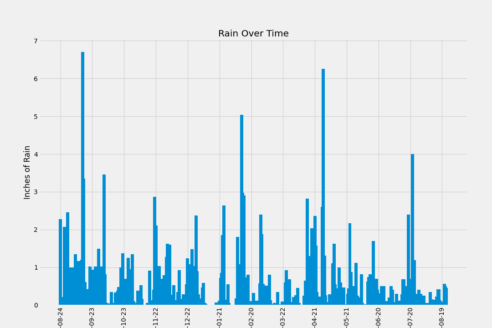
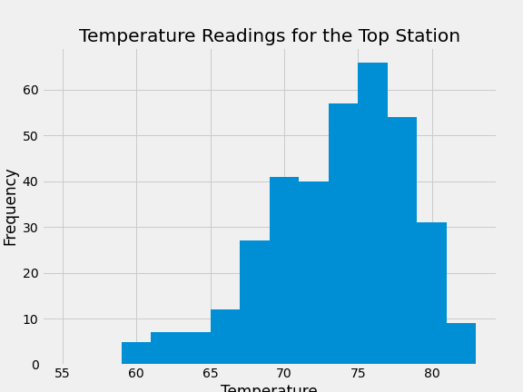

# Climate Analysis with SQL and Python


- ## Overview
  - The objective of the project was to turn 2 CSV files into an SQL database using the Python Library SQLAlchemy. These CSV files contained metadata about specific weather stations and weather observation data from these stations. Once created, this SQL database was analyzed to create visualizations about precipitation data and station specific data. Next, an API with multiple routes was created. This API returns precipitation data, temperature data, station metadata, and aggregate temperature data for a specific data range.

- ## Programs, Languages and tools
    - SQL
    - Python
    - Python Libraries:
        - Matplotlib
        - Numpy
        - Pandas
        - Datetime
        - SQL Alchemy
        - Flask

- ## File overview
  - ### app.py
    ##### *description of file*
  - ### climate.ipynb
    ##### *description of file*
  - ### hawaii_measurements.csv
    ##### *description of file*
  - ### hawaii_stations.csv
    ##### *description of file*
  - ### hawaii.sqlite
    ##### *description of file*


- ## Creating Database
    1. Use SQLAlchemy's create_engine to connect to database
    ```python
        engine = create_engine("sqlite:///Resources/hawaii.sqlite")
    ```
    2. Use automaping to reflect tables into classes and save as variables called Station and Measurement
    ```python
        Base = automap_base()
        Base.prepare(engine,reflect=True)
    ```


- ## Analysis and Visualizations
    1. Designing an query that returns 12 months of precipitation data and plot
        - Define the start and end dates
            ```python
            ### getting the end date
            max_date = session.query(func.max(mt.date)).first()[0]
            ### formatting to date time format
            max_date = dt.datetime.strptime(max_date,'%Y-%m-%d')
            # Calculate the date 1 year ago from the last data point in the database
            year_ago =(max_date - dt.timedelta(weeks=52)).replace(day=max_date.day)
            ##### converting it into a format that we're able to query with
            year_ago = f'{year_ago.year}-{year_ago.month:02d}-{year_ago.day:02d}'
            ```
        - Use SQL Alchemy's ORM tool session to perform query on database
            ```python
            # Perform a query to retrieve the data and precipitation amounts
            annual_pre_list = session.query(mt.date,mt.prcp).filter(mt.date>year_ago).all()
            ```
        - Plot data using matplotlib
        
            
    2. Station Analysis
        - Create a query to calculate the total number of stations
            ```python
            station_count = engine.execute("SELECT COUNT(station.id) FROM station").fetchall()[0][0]
            ```
        - Design a query with the max temperature, minimum temperature, average temperature, and count of observations for each station
            ```python
                station_activity_list = engine.execute("SELECT DISTINCT station, (SELECT COUNT(measurement.id) FROM measurement WHERE measurement.station=station.station) as meas_count,(SELECT MAX(measurement.tobs) FROM measurement WHERE measurement.station=station.station) as max_temp,(SELECT MIN(measurement.tobs)FROM measurement WHERE measurement.station=station.station) as min_temp,ROUND((SELECT AVG(measurement.tobs)FROM measurement WHERE measurement.station=station.station),2) as avg_temp, name FROM station ORDER BY meas_count DESC").fetchall()
            ```
        - Use a query to retrieve the last 12 months of temperature observation data for the station with the most observations
            - Use the top station ID and start data to query the temperature data
            ```python
            top_station_temps_df=pd.DataFrame(session.query(mt.date,mt.tobs).filter(mt.station==top_station,mt.date>top_first_date).all())
            ```
            - Plot the results in a histogram

                

- ## API Creation
    1. Creating the flask application
    ```python
        app = Flask(__name__)
    ```
    2. Create each endpoint
        - Home Page
            ```python
                @app.route("/")
                def home():
                    route_dict={
                    "Lists the precipitation by date":"/api/v1.0/precipitation",
                    "List station names and their ID's":"/api/v1.0/stations",
                    "Lists the last year of temperature data for the most active station":"/api/v1.0/tobs",
                    "Returns the Average, Minimum and Maximum Temperature for all dates including and beyond the start date ":"/api/v1.0/<start>",
                    "Returns the Average, Minimum and Maximum Temperature for the date range":"/api/v1.0/<start>/<end>",
                    }

                    return jsonify(route_dict)
            ```
        - Precipitation Page
            ```python
            @app.route("/api/v1.0/precipitation")
            def precipitation():
                print("sucessfully reach the precipitation page")
                #### query to get the date and preciptation
                prec=dict(engine.execute('SELECT date,prcp FROM measurement').fetchall())
                return jsonify(prec)
            ```
        - Stations Page
            ```python
            @app.route("/api/v1.0/stations")
            def stations():
                print("sucessfully reached the stations page")
                #### gets the station id and name  for the stations page
                station=dict(engine.execute("SELECT station,name FROM station").fetchall())
                return jsonify(station)
            ```
        - Temperature Page
            ```python
            @app.route("/api/v1.0/tobs")
            def temperature():
                print("sucessfully reached the temperature page")
                ### define the station id for the top 
                top_station_id = "USC00519281"

                ### gives the date range to use for a given station number in the "first_date,last_date" format
                top_last_date = dt.datetime.strptime(session.query(mt.date,mt.tobs).filter(mt.station==top_station_id).order_by(mt.date.desc()).all()[0][0],'%Y-%m-%d')
                top_first_date = top_last_date - dt.timedelta(days=365)

                ### query to get the last year of data for the top station
                temp_page_result = dict(session.query(mt.date,mt.tobs).filter(mt.station==top_station_id,mt.date>top_first_date).all())
                session.close()
                return jsonify(temp_page_result)
            ```
        - Start Date Page
            ```python
            @app.route("/api/v1.0/<start>")
            def start_page(start):
                print("sucessfully reach the start page")
                start_date=str(start)

                spr_max=engine.execute(f'SELECT MAX(measurement.tobs) FROM measurement WHERE measurement.date>{start_date}').fetchall()[0][0]
                spr_min=engine.execute(f'SELECT MIN(measurement.tobs) FROM measurement WHERE measurement.date>{start_date}').fetchall()[0][0]
                spr_avg=round(engine.execute(f'SELECT AVG(measurement.tobs) FROM measurement WHERE measurement.date>{start_date}').fetchall()[0][0],2)

                start_page_results_dict = {
                    "Average":spr_avg,
                    "Max":spr_max,
                    "Min":spr_min
                }

                return jsonify(start_page_results_dict)
            ```
        - Date Range Page
            ```python
                @app.route("/api/v1.0/<start>/<end>")
                def startend_page(start,end):
                    print("sucessfully reach the start_end date page")
                    start_date=start
                    end_date=end

                    all_dates=engine.execute('SELECT measurement.date FROM measurement').fetchall()
                    max_date_available=engine.execute('SELECT MAX(measurement.date) FROM measurement').fetchall()[0][0]
                    min_date_available=engine.execute('SELECT MIN(measurement.date) FROM measurement').fetchall()[0][0]
                
                    #clean up the all_dates list
                    all_dates= [x[0] for x in all_dates]


                    ### returns the results if the dates entered are within data
                    if dt.datetime.strptime(start,'%Y-%m-%d') and dt.datetime.strptime(end,'%Y-%m-%d') in [dt.datetime.strptime(str(x),'%Y-%m-%d') for x in all_dates]:
                        r_max=session.query(mt.tobs).filter(mt.date>=start_date,mt.date<=end_date).order_by(mt.tobs.desc()).first()[0]
                        r_min=session.query(mt.tobs).filter(mt.date>=start_date,mt.date<=end_date).order_by(mt.tobs.asc()).first()[0]
                        r_avg=round(session.query(func.avg(mt.tobs)).filter(mt.date>=start_date,mt.date<=end_date).order_by(mt.tobs.desc()).all()[0][0],2)
                        session.close()
                        start_end_results_dict = {
                        "Average":r_avg,
                        "Max":r_max,
                        "Min":r_min
                        }  

                        return jsonify(start_end_results_dict)

                    else:
                        ### prints out the available date range if used enters date beyond data
                        return f'your range must be between {min_date_available} and {max_date_available}'

            ```


- ## Instructions on how to use the API
    - Run the app.py file
    - Select the link that comes up in the terminal once the file runs. This link will bring you to the home page and is typically http://127.0.0.1:5000
    - The routes will be listed on the home page. Add any of these routes to the base url to access each endpoint

        - Lists the precipitation by date:"/api/v1.0/precipitation"

        - Lists station names and their ID's:"/api/v1.0/stations"

        - Lists the last year of temperature data for the most active station:"/api/v1.0/tobs"

        - Returns the Average, Minimum and Maximum Temperature for all dates including and beyond the start date :"/api/v1.0/<start>"

        - Returns the Average, Minimum and Maximum Temperature for the date range:"/api/v1.0/<start>/<end>"
